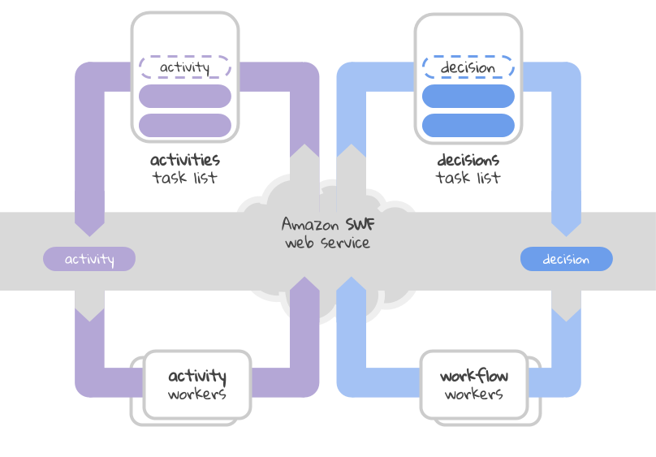
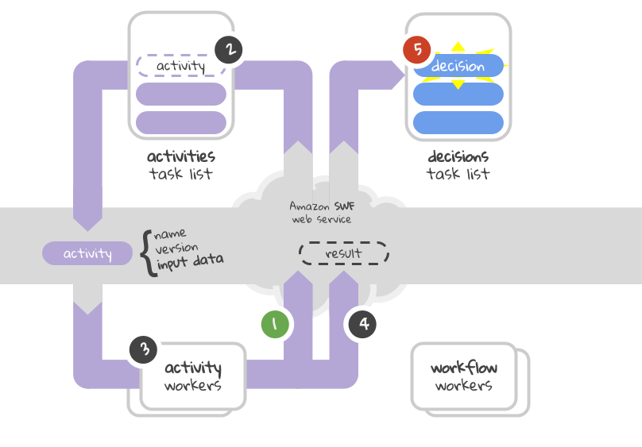
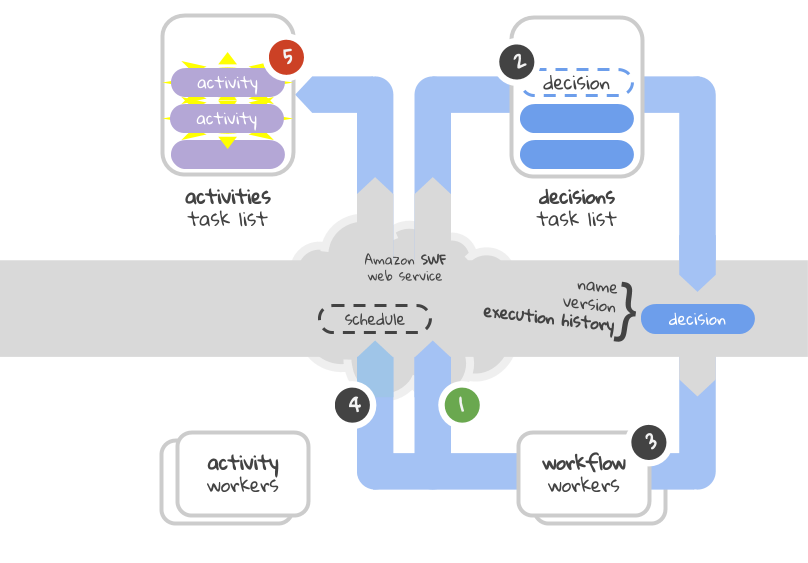
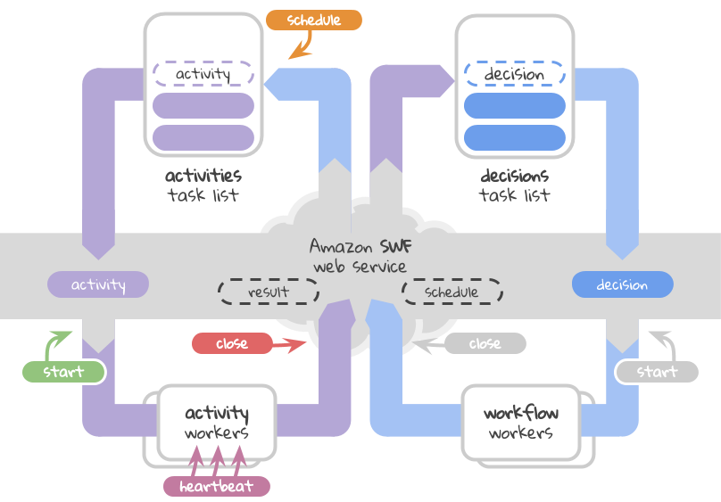

Introduction
============

This is a high-level overview of Amazon Simple Workflow. In few words SWF is a
web service over two different types of queues. In SWF parlance the queues are
called task lists because they have some special behavior that queues don't
have. But for now we're better of if we're thinking of them as queues.

Polling Tasks
-------------

One of the things that we usually do with queues is to pop values out. In SWF
we do this with HTTP long polling *(since it's a websevice)*. Here's a diagram
of this process:

   Polling tasks from the task lists using HTTP long polling

Here we can see the two different types of task lists in action:

* The activities task list is like your regular job queue, each activity
  represents a specific task, part of a workflow. The activity workers consume
  this task list, polling and executing activities in a never ending loop. You
  can have many activity workers working in parallel.

* The decisions task list is  similar with the activities task list. You have
  some workers polling decisions and executing them in a never ending loop. The
  difference between a decision and an activity is that the decision doesn't do
  any actual processing. The decisions act as coordinators for activities. You
  can say that a workflow logic is the sum of all decisions needed for it. At
  the same time the actual computation of a workflow is the sum of all
  activities executed.

Activity Lifecycle
------------------

Lets focus on running activities now. We said earlier that activities are just
like your regular jobs in a job queue. But we didn't mention what happens after
an activity is executed. Where does the result go and how does that affect the
workflow?

   Polling and running activities

Lets go over the entire lifecycle of an activity step by step:

#. The activity workers start by long polling the SWF web service.
#. As soon as there is an activity waiting in the activities task list it will
   be sent to one (and only one) of the listening workers. *(We'll see later
   how an activity is added to a task list.)*
#. Each scheduled activity has two parts: an identity composed by a name and a
   version and some input data. After a worker retrieved an activity it uses
   the identity to locate the corresponding code and launches it passing the
   input data. *Note that there is no code passed with the activity so the
   worker must know the activity code beforehand.*
#. After the activity is executed the final result is sent back to SWF.
#. When the result is sent, a new decision will automatically be added in the
   decisions task list.

Decision Lifecycle
------------------

Decisions are similar with activities in how they run but serve a different
purpose. Instead of executing different types of data processing, a decision
orchestrates activities based on the current workflow execution history.

   Polling and running decisions

As you can see, this diagram is very similar with the previous one but the
direction of the arrows is reversed. Lets go again over all the steps one by
one:

#. The workflow workers start by long polling the SWF web service.
#. As soon as there is a decision waiting in the decisions task list it will be
   sent to one (and only one) of the listening workers. *(As we already saw,
   when an activity is completed and sends back its result, a decision is
   automatically added in the task list).*
#. Each scheduled decision has two parts: an identity composed by a name and a
   version and an execution history. The execution history contains the entire
   state of the workflow: the previous activities that have been scheduled,
   their status and results. The worker identifies the corresponding workflow
   logic using the identity and figures out what other activities can be
   scheduled if any.
#. It then sends back the list of new activities that should be scheduled,
   together with their input data.
#. The activities that have been scheduled will appear on the activities task
   list to be consumed by the activity workers which in turn create more
   decisions. The cycle repeats itself until a decision chooses to finish the
   workflow.

The decision task list has some additional guarantees:

* No two workers can process decisions for the same workflow at the same time,
  making the decisions belonging to the same workflow sequential.
* A decision always contains the most recent history of a workflow execution.

Execution Timeout
-----------------

   Different types of execution timeouts

When dealing with distributed systems, software and hardware failure is
inevitable. Amazon SWF deals with failures using timeout timers. An activity
execution should define 4 different timers:

* **schedule to start** - The maximum time an activity can spend in the
  activities task list waiting to be polled.
* **start to close** - The maximum duration an activity can spend running.
* **schedule to close** - The maximum duration the previous two steps combined
  can take. *(If this value is larger or equal to the sum of the previous two
  values it has no practical effect.)*
* **heartbeat** - The maximum interval in which an activity must report progress
  back.

If any of those timers expire a new decision is automatically scheduled and the
failure will be recorder in the execution history. In case an activity tries to
send a result back to SWF after it timed-out, the result is discarded.
Activities can use the heartbeat mechanism to detect timeouts and abort
execution early.

There are 2 additional timers that can be defined at the workflow execution
level:

* **workflow duration** - The maximum time the entire workflow (with its
  activities and decisions) can run for. When this timer is exceeded the entire
  workflow execution is considered timed-out. There is no way to recover from
  such an error other than starting a new execution.
* **decision duration** - This one represents how much time can be spent by a
  decision task to download and analyze the execution history and coordinate
  other tasks. When this time-out is recorded, a new decisions is added
  automatically in the decision task list. Late instructions received after
  this timer expired are ignored.

Additional Reading
------------------

There is a lot more to learn about Amazon SWF. If you want to find out more
about it the `Developer Guide`_ is a good place to start, especially the
`Introduction`_ and `Basic Concepts`_.

.. _Developer Guide: http://docs.aws.amazon.com/amazonswf/latest/developerguide/
.. _Introduction: http://docs.aws.amazon.com/amazonswf/latest/developerguide/swf-dg-intro-to-swf.html
.. _Basic Concepts: http://docs.aws.amazon.com/amazonswf/latest/developerguide/swf-dg-basic.html
